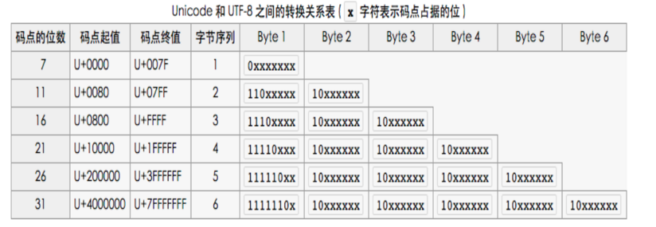

# Ajax和Comet

Ajax 是 Asynchronous JavaScript + XML 的 缩写。但是这个技术和 XML 格式是没有任何关系的。 Ajax技术的核心在于 **XMLHttpRequest对象**。

***

### XMLHttpRequest 对象

在现代浏览器中创建XMLHttpRequest对象是非常容易的，浏览器原生支持XMLHttpRequest类型，但是在老的浏览器，比如IE低版本中，创建XMLHttpRequest对象却是比较麻烦的，IE的低版本中有三种不同版本的XHR对象。

>> 这三种IE中不同版本的XHR控件名是 : MSXML2.XMLHttp  MSXML2.XMLHttp.3.0  MSXML2.XMLHttp.6.0

***

#### xhr的使用

XMLHttpRequest对象的核心方法就是**open()**,该方法可以**初始化**一个请求，具有以下参数:
* method  表示请求类型的字符串， "GET" "POST" "PUT" 等,常用的其实只有 "GET" 和 "POST"，这个字符串最好大写，这样兼容性最好
* url     表示发送请求到哪个URL地址去。 如果是在"GET"请求中，这个url还附带着请求的参数信息。
* async     可选的参数，表示是否异步请求(默认的就是异步方式)，true为异步，false为同步，同步请求现在已经不推荐了。
* user      可选的参数，表示用于认证的用户名，很少用到。
* password  可选的参数，表示用于认证的密码，很少用到。

使用**异步Ajax请求的关键**就在于监听 xhr对象的 **readystatechange** 事件，xhr对象的 **readyState属性**具有以下值:
* 0 未初始化状态  (尚未调用open方法)
* 1 启动状态     (调用了open方法 但是没有调用send方法) 
* 2 发送状态(准确的说是 **收到响应头状态**) (调用了send方法后)  此时**已经收到了响应头**
* 3 接受状态     (已经接受到了部分响应数据) 此时开始接受**部分响应实体**内容
* 4 完成状态     (响应数据已经接受完全了)   此时响应实体内容已经接受完成

在实际的使用中， readyState=4 的情况更多的说在说明**请求已经有结果**了:这个结果可以是正常获取响应数据，也可以是abort终止请求，超时请求。对于XHR对象来说，这些都是属于完成状态.

xhr对象具有以下跟**响应有关的属性**，这些属性的值会在收到服务器响应后**自动填充到xhr对象**里去:
* status 表示响应的HTTP状态码。 据此可以判断响应是否成功
* statusText HTTP状态码的说明，一般不会使用。
* responseText 表示响应被返回的文本内容。默认为 空字符串""。
* responseXML  当响应的内容类型为"application/xml"或"text/xml"时，这个属性保存响应数据的XML DOM文档。默认为null。

***

#### HTTP头部信息

HTTP头部信息其实就是在浏览器在发送HTTP请求时，消息头的内容。

一个完整的HTTP消息(请求和响应)必定有以下内容组成:
* 一个请求行或者响应行 GET / HTTP/1.1    HTTP/1.1 200 OK
* 若干消息头  这些消息头用于描述HTTP消息本身的信息。
* 实体内容(可以为空)

在发送Ajax请求时，我们可以在xhr对象send发送之前，使用 **setRequestHead(key,value)** 方法来新增或者设置请求头的内容。
但是需要注意的是，浏览器默认会设置许多请求头信息，比如Host User-Agent 等消息头，往往浏览器不会允许我们操作这些默认的请求头，因此，如果我们真要设置请求头，务必使用自定义的请求头。

而在接受到服务器响应后，我们则可以通过 **getAllResponseHeaders()方法**获取包含整个响应头信息的字符串。 当然也可以使用 **getResponseHeader(key)方法**来获取某个响应头消息的内容。

***

#### GET请求和POST请求

在Ajax请求中，通过设置xhr的第一个参数为"GET"或者"POST"可以更改请求的方式。

对于GET请求来说，请求的参数需要**附加在URL**中，因此，必须使用**encodeURIComponent**方法对请求参数进行编码。而在send的时候，无需为请求实体添加数据。

对于POST请求来说，请求的参数则**位于请求实体**中,因此,支持的参数的**格式不限**，数据长度也非常大。 而我们可以通过设置**Content-Type**请求头信息来设置请求实体的MIME类型。

***

### XMLHttpRequest 2级

起初xhr在各大浏览器的实现统称为XMLHttpRequest 1级，因为这些实现已经成了事实标准。

随后W3C组织开始规范化XMLHttpRequest的标准，就称之为2级。

***

#### FormData类型

表单提交的数据编码格式(**表单的enctype,请求的Content-Type**)有两种:
* application/x-www-form-urlencoded 默认的数据编码格式，不能提交文件。
* multipart/form-data 可以提交文件。

而提交表单的数据的方式有很多种:
* 表单原生的提交(会跳转页面)
* Ajax请求(无跳转不刷新)
* 隐藏IFrame提交(无跳转不刷新)

在Ajax请求提交表单数据的时候，我们可以**自己处理表单字段并通过设置Content-Type请求头**来控制表单的数据提交，也可以直接使用HTML5提供的FormData数据来方便的提交表单的数据。

FormData类型的构造函数有两种:
* 无参数形式 创建一个空的FormData对象
* 以表单元素为参数  将该表单的字段填充进创建出的FormData对象中

而FormData类型填充数据的方式非常简单,核心在于**append函数**:
* append(keyString,valueString) 用于填充普通字符串格式的表单数据。
* append(keyString,Blob,name)   用于填充Blob二进制文件格式的表单数据。 其中name是可选的文件名。如果不设置name，默认就是"blob"为文件名。

我们可以自定义的填充数据到FormData对象中，并通过xhr对象的send方法发送请求，send方法不仅可以接受字符串，还可以**直接接受FormData类型对象**并发送。
并且，在这种情况下，**默认的Content-Type**就是 "multipart/form-data" 类型。

***

#### 请求的超时设定

在**XMLHttpRequest**中新增了一个 **timeout属性**，该属性表示请求send发送后多少**毫秒**后如果没有接受到响应则请求超时并自动取消请求。

与之对应的则是 **XMLHttpRequestEventTarget**中 具有一个 **ontimeout** 属性用于监听 timeout超时事件。

Ajax的超时设定只能在异步模式下才能使用，在同步请求中设定超时时间timeout会直接报错。

同时为了兼容IE，必须在**xhr对象open初始化以后，send发送之前**才能设置timeout属性,而ontimeout事件监听则无所谓。

需要注意的是，如果请求超时了，那么当请求取消后，会自动将xhr对象的**readyState设置为4**一一也就是表示请求完成的状态,但是,xhr对象的status属性一一**HTTP状态码会设置为0**。

***

#### UTF-8与Unicode编码互转

在讲响应类型之前，我们先说明一下编码的问题。 首先在JavaScript中**字符编码是采用的Unicode编码**，但是，往往数据传输时，使用的是UTF-8编码，这是一种可变长的针对Unicode的编码方式。

对于**不同码值**的Unicode字符，UTF-8编码的长度也是不同的:
* 0 ~ 0x7F  UTF-8编码长度为1个字节         
* 0x80 ~ 0x7FF UTF-8编码长度为2个字节 
* 0x800 ~ 0xFFFF UTF-8编码长度为3个字节
* 0x10000 ~ 0x1FFFFF  UTF-8编码长度为4个字节
* 0x200000 ~ 0x3FFFFFF UTF-8编码长度为5个字节
* 0x400000 ~ 0x7FFFFFF UTF-8编码长度为6个字节

由此可以看到，可以通过UTF-8编码的第一个字节来计算出某个字符的整个UTF-8编码字节长度。 因为UTF-8编码中只有第一个字节的前缀模式是不同的，后续字节的模式都是 10XXXXXX。

由此我们可以轻松的完成Unicode编码到UTF8编码的转换：
* 将unicode编码先对照码值，明确转换后的UTF8编码长度
* 将unicode编码转化成二进制。
* 将二进制的unicode编码逐个补位到UTF-8编码中的X空缺位置。

而UTF8编码转换为Unicode编码则是这个的逆过程。

***

#### 响应的数据类型

服务器发来的响应信息，xhr对象可以选择不同的方式来解析他。 需要注意的是，服务器发送的响应数据本质上是一样的，只是我们可以通过设置，来让浏览器帮我们按照设置值来解析响应数据，免去我们自己处理响应数据的麻烦。

设置响应数据类型的方式有两种:
* xhr对象的**responseType属性**(XMLHttpRequest2级新增)
* xhr对象的**overrideMimeType方法**(XMLHttpRequest1级内容)

首先讲推荐使用的 responseType属性,这个属性具有以下值:
* ""             空字符串默认值，响应会被解析为文本字符串
* "arraybuffer"  响应会被解析为ArrayBuffer类型的二进制数组
* "blob"         响应会被解析为Blob对象
* "document"     响应会被解析为Document对象 (比如xml)
* "json"         响应会被解析为JSON对象
* "text"         响应会被解析为纯文本

这里再次重申一次，设置responseType的作用只是让浏览器来直接**帮我们按照指定类型来解析响应数据，同一份原始响应数据在不同的解析方式下会有不同的表现,但是原始数据是不变的**！

配合responseType使用的是**response属性**,和responseText属性**只能**应用于获取纯文本不同，response属性可以用于获取所有类型的响应信息。

当响应没有完成时(也就是xhr的readyState属性不为4)，如果响应信息为"text"或者""纯文本类型，那么response和responseText属性**返回 "" 空字符串**，而当响应类型设置为其他类型时，response属性**返回null**。

而当响应完成时，response属性会返回**经过我们设置的响应类型处理后**的对象。

而overrideMimeType方法则是在老版本的浏览器中使用的，通过**指定MIME类型**来解析服务器返回的数据，需要注意的是，在最新的浏览器上使用已经没有效果了,获得的数据并不是指定的MIME类型对象，而依旧是纯文本。

***

#### 二进制数据处理

一般而言，xhr发送或者接受的都是纯文本，或者是JSON格式的数据，而如果需要进行上传文件等操作，就需要发送二进制数据了。

这里先不考虑使用FormData类型进行文件上传操作，而是单纯的在xhr中发送和接受二进制数据。

对于发送二进制数据，xhr原生就支持**send(ArrayBuffer类型)**. 而ArrayBuffer类型正是原始二进制数据的缓冲区类型。因此，我们可以通过使用ArrayBuffer来进行二进制数据发送。

同理 Blob类型的类文件对象也是被**send(Blob)**方法支持的，我们也可以使用Blob类型进行二进制数据的发送。

当然，更常用的是利用xhr的**send(ArrayBufferView类型)**，**ArrayBufferView类型**包含了 Uint8Array,Int8Array等各种 TypedArray 类型。
我们可以通过操作这些类数组类型来操作我们要发送的二进制数据。这种方式是非常自由的，我们可以**完全操控**二进制数据的序列。

***

### 进度事件

Progress Event 进度事件 定义了 客户端与服务器通信有关的事件。最开始这些API都是只针对XHR的，但是后续也被其他部分借鉴。

总的来说，进度事件包含以下6种:
* loadstart  在收到响应头时触发， 触发顺序永远**排第一位**
* progress   在接受响应实体过程中**不断触发**
* error      在请求发生错误的时候触发
* abort      **只在**主动调用abort()函数终止请求时触发
* load       在收到完整的响应数据的时候触发。 也就是说响应实体已经完全接受完毕了。
* loadend    在通信完成后触发。  触发顺序永远**排最后一位**。

这里需要注意的其实只有以下点:
* load事件并**不关心响应到底是什么**，不管HTTP状态码是200还是400，只要客户端接受到了服务器的响应信息，那么就会触发load事件
* abort事件**只有**在主动调用abort()方法的情况下才会触发。
* 当请求超时 时,并不会触发error或者abort事件，只会触发timeout事件。
* loadstart 和 loadend 事件**永远都会触发**，并且分别首先触发和最后触发。

还有一点也很重要， load 事件并不能 取代 readystatechange事件用于**检测请求完成状态的功能*， load事件的完成和 readystatechange事件中的完成是不同的:
* load事件的完成状态 , 必须是**服务器完全返回数据**后。
* readystatechange的完成状态, 还包含了 请求超时，请求终止等情况，这些情况对于XHR对象来说，都是**意味着一次请求的终结**。

这两者的区别具体就表现在了 超时请求以及主动终止请求的情况下，readystatechange事件中readyState会变成4，但是load事件并不会触发。

***

#### progress事件

progress事件主要用于描述发送请求以及接受响应时数据的传输状态。

progress事件的**事件对象**具有三个属性：
* lengthComputable 布尔值，用于表示进度是否是可以估算的。
* loaded  unsigned long long 类型的整数，这个类型是**64位**的，也就是最大可以表示 2^64-1. 这个属性表示的是 **已经发送/接受 的字节长度**
* total  unsigned long long 类型的整数，这个类型是**64位**的，也就是最大可以表示 2^64-1. 这个属性表示的是 **需要发送/接受 的总字节长度**，并且是**不计算头部信息这些额外开销，仅仅计算实体内容**。

只有在 lengthComputable为true的情况下，loaded和total属性才可以访问到实际的内容。 
在接受响应时，只有当**服务器设置了Content-Length**这个响应头，progress事件对象的lengthComputable属性值才是true，我们才能获取到 接受响应数据的进度。

当我们在下载文件时， progress事件是在 XHR 对象上触发的。

但是当我们上传文件时， progress事件是在 XHR对象的**upload属性**上触发的。

***

### 跨域资源共享 (HTTP访问控制)

跨域资源共享CORS(Cross Origin Resource Sharing)也可以叫做HTTP访问控制。 这是一种机制，核心是利用了HTTP协议，使用**自定义的请求头**来与服务器进行协商，从而决定请求或者响应是否应当成功。

这里我们首先要明确一点一一浏览器**设置同源策略的目的**是什么? 浏览器的同源策略的目的并不是为了保护服务器返回的数据不被滥用，而是**为了保证其他源的脚本不能与源资源进行交互**，甚至我们可以认为，这是在保护源网站的“版权”。

事实上，浏览器的同源策略也无法保护浏览器返回的数据不被别人窃取，因为，毕竟网站是公开的，数据在被**正常访问**时是必定会返回的，甚至我们可以直接绕过浏览器构造套接字来与服务器的HTTP服务进行交互。

代码中的请求和响应的过程分为下面两步:
* 请求从我们的脚本代码发出，会**经过浏览器的处理**再发送给服务器，在这个处理过程中，会自动添加一些请求头的内容。
* 响应从服务器发送到浏览器，浏览器会根据其同源策略，按照HTTP访问控制机制，**对非法跨域请求的响应信息进行拦截**，使得我们的脚本代码无法接受到服务器返回的信息。

整个过程，都是在浏览器的**监控下**完成的,我们能设置哪些请求头信息，获取哪些响应头信息，也都是浏览器决定的。
因此，跨域资源共享成功，只是代表浏览器没对返回的数据进行拦截，而跨域资源共享失败，只是因为浏览器接受到返回的数据后**禁止脚本访问**罢了。

同源策略本质上是一种**客户端(浏览器)对源资源保护**的技术。他只能保证当**用户使用客户端**的时候，源资源的"版权"。  服务器端也可以有自己的认证机制，来对资源的使用进行保护。

跨域资源共享的首要前提，是服务器端对该请求是提供响应服务的。 

而HTTP访问控制机制，其实就是在这个前提之上，利用自定义请求头，在响应信息发送到浏览器后，由浏览器根据HTTP头信息来决定是否把服务器的响应结果交给脚本代码。

跨域资源共享分为两种类型:
* 简单请求
* 需要预检的请求

***

#### 简单请求的CORS

当一个请求**满足以下所有条件**，就是一个简单请求:
* 请求方式是以下3种之一:  
    * GET 
    * POST 
    * HEAD 
* **手动设置**的请求头只有以下4种:
    * Accept            用来告诉服务器 客户端可以处理什么MIME类型
    * Accept-Language   用来告诉服务器 客户端使用的是什么自然语言
    * Content-Language  用来告诉服务器 客户端希望服务器返回什么自然语言版本的实体内容
    * Content-Type      用来告诉服务器 客户端发送的数据是什么MIME类型
* 设置的Content-Type请求头值是以下3种之一:
    * text/plain       
    * multipart/form-data
    * application/x-www-form-urlencoded
* 请求的XMLHttpRequestUpload对象(也就是XMLHttpRequest.upload对象)**没有任何事件监听**。

简单的跨域请求在发送和接受后,具有以下特征:
* cookie不会伴随请求发送。
* 响应成功后，不能获取所有的响应头信息，只能获取 **Cache-Control、Content-Language、Content-Type、Expires、Last-Modified、Pragma**这6个响应头信息的内容。

服务器对于简单请求的CORS是通过设置 **Access-Control-Allow-Origin**响应头来实现的。

当请求从浏览器发出时，浏览器会**自动**在请求的请求头中添加 **Origin**请求头，服务器来接受到请求后，根据Origin请求头的内容，可以在服务端决定是否响应数据，这是服务器端的响应控制。  

就算服务器端决定正常返回数据，此时响应HTTP状态码为200，如果服务器没有设置Access-Control-Allow-Origin响应头，或者请求头的Origin值不在响应头的Access-Control-Allow-Origin值范围内，
那么浏览器也会**自动拦截**响应信息，禁止脚本代码获取响应信息，并会抛出一个错误，这个错误会被XMLHttRequest的error事件监听捕获。 这是浏览器端的控制。

***

##### 预检请求

在说 需预检请求之前，先说明一下预检请求。

预检请求是以**OPTIONS请求方式**发送的请求，并携带以下请求头:
* Access-Control-Request-Method 用来说明**实际请求**的请求方式
* Access-Control-Request-Headers 用来说明**实际请求**设置的额外的请求头字段，用逗号分隔

当OPTIONS预检请求到达服务器后，服务器可以返回以下响应头来处理预检信息:
* Access-Control-Allow-Origin  设置跨域范围，必需。
* Access-Control-Allow-Methods 返回允许的 **需要预检的请求** 的请求方式。 对于 GET POST HEAD 请求方式的实际请求，可以不返回这个响应信息。
* Access-Control-Allow-Headers 返回允许的 **需要预检的请求** 的可以设置的额外请求头字段，用逗号分隔。 如果实际请求没有设置额外的请求头，该响应信息也可以不返回。
* Access-Control-Max-Age       返回该预检请求的有效期数字，单位是秒，有效期内再次发送需预检的请求 不需要再经过预检流程。如果值为0，那么每次都需要发送预检请求。服务器可以不返回这个响应头信息，此时有个默认的有效期一一**由浏览器决定**。

此时，浏览器实际只发送了一个 OPTIONS 预检请求，**实际的需预检请求还没有发送出去**，当服务器返回对预检请求的处理后，浏览器检查实际发送的请求是否符合服务器的响应头的要求:
* 如果不符合要求，那么实际的请求不会发送出去，直接被**浏览器拦截**，并且抛出一个错误，xhr对象会捕获一个error事件。
* 如果符合要求，那么浏览器会发送实际请求到服务器，服务器这次**就像处理简单请求一样，处理需预检的请求**。

在整个流程中要注意以下几点:
* 预检请求是浏览器**自动**发出的，浏览器根据**需预检请求的请求头和请求方式**来**自动设置预检请求的请求头**。我们不能在脚本里自己发送预检请求。
* 预检请求对于脚本代码来说，是**透明**的。 脚本代码**无法感知**到预检请求的发送和接受，同时预检请求的响应信息脚本是无法获取到的。

本质上，预检请求就是一个**预先检测**的请求。这个请求使得浏览器和服务器可以进行协商,经过协商后，浏览器可以做出以下决定:
* 是否发送实际请求到服务器 (由服务器响应的预检头信息决定)
* 是否将服务器的响应信息交给脚本
* 是否下次需预检请求 需要发送预检请求。(由服务器返回的Access-Control-Max-Age和浏览器自身的安全策略决定)

而这个协商对于服务器来说，为服务器在浏览器中提供的HTTP服务提供了一种资源保护机制，服务器可以依靠设置响应的预检头信息，来设置自己**在浏览器中**的跨域服务策略。

这里一再强调是在浏览器中，就是开头所说的，所谓的跨域资源共享(HTTP访问控制),只在浏览器是具有意义的。脱离了浏览器这个客户端，如果想要访问服务器某个接口的响应，在通过服务器端的验证后，直接访问即可。

这里所说的所有的HTTP访问控制，都**只限于浏览器作为客户端**的情况下，就算是服务器**通过响应头信息**的确参与了HTTP访问控制的环节，但是这并不是服务器自身的HTTP服务认证。

服务器自身的HTTP服务认证，是根据请求的发送者的请求参数(比如cookie)等方面进行用户权限认证一一该用户是否具有访问这个接口的权限，按照自身的算法，如果通过验证，那么就返回数据，否则直接不给予处理。

此时，客户端并不局限在浏览器中，**任何能向服务器80接口发送请求的软件或设备**都在服务器自身HTTP服务认证的管控下。

***

#### 需预检的请求的CORS

所有不是简单请求的请求，都是 需预检的请求。

在脚本中发送 需预检的请求，和发送简单请求，在脚本层面看是没有任何区别的，因为浏览器作为中间层已经将 预检请求部分 处理了。

在脚本中发送请求，以及发送什么请求，最后收到何种响应， 脚本本身是无法控制的，整个过程的控制者是浏览器以及服务器。

这里只说以下几点:
* GET POST HEAD 方式的 需预检的请求，服务器可以不返回**Access-Control-Allow-Methods**响应头信息，浏览器依旧会发送实际请求。
* 需预检的请求和简单请求一样，只能访问规定内的响应头信息，无法发送和接受cookie。
* 服务器对于需预检的请求的响应信息里，不用包含预检相关的响应头，但是必须包含**Access-Control-Allow-Origin**来允许跨域。

***

#### 携带凭证的请求的CORS

这里所说的凭证指的是cookie。 

携带cookie的请求的跨域只和以下三点有关:
* xhr对象的**withCredentials** 属性必须设置为true
* 服务器的**Access-Control-Allow-Credentials**响应头必须设置为true
* 服务器的Access-Control-Allow-Origin响应头必须设置为**请求的origin 而不能为 * 值**

只要同时满足以上三点，那么以下:
* 请求中携带**Cookie请求头**(浏览器自动添加)用来发送浏览器中的cookie信息
* 响应中携带**Set-Cookie响应头**用来设置浏览器中的cookie信息

这两点功能都可以成功实现。

这里唯一要注意的一点是，对于 需预检的请求的跨域cookie发送，服务器在**对OPTIONS预检请求的处理**中：
* 响应头Access-Control-Allow-Credentials响应头也必须设置为true
* Access-Control-Allow-Origin响应头也必须设置为请求的origin而不能是随意的 * 值

当跨域请求发送的凭证的范围并**不仅仅局限于cookie**时，我们可以**使用自定义请求头来发送任意数据作为凭证信息**。
此时只需要在请求中设置某个自定义请求头，此时，该请求会**变成需预检的请求**，因此我们还需要在服务器端**对预检请求的处理中设置Access-Control-Allow-Headers**允许该自定义的请求头。
当然，在这种情况下，将**凭证信息作为请求参数**发送到服务器上也是可以的,甚至更简便，此时服务器只需要当做需预检的请求进行处理即可，无需设置额外响应头。

***

### 其他跨域技术

Ajax技术并不是必须依赖于XMLHttpRequest，XMLHttpRequest只是Ajax技术最核心的对象罢了。 还有其他手段可以进行Ajax通信。

在Ajax跨域时，可以利用DOM中**本身就可以进行跨域请求**的元素，进行Ajax跨域通信。
 
比如 script元素,link元素,img元素,这些自带src属性的DOM元素都可以不受同源策略的影响，进行跨域请求。

***

#### 图像Ping

图像Ping就是就是利用 img 元素来进行跨域通信的技术。 因为对图像的请求是不会受同源策略影响的，因此我们可以对**图片的src属性**中的**URL请求地址中附加上我们想要传递的信息**。

图像Ping技术的请求方式是**固定的GET方式**请求，并且，是**单向传递信息**一一从浏览器到服务器端的单向通信，同时传递的信息也只能是字符串形式。 我们在脚本中**无法读取服务器响应的内容**。

通过img元素的 load事件 以及 error事件，我们可以监听到服务器是否收到了信息：
* 如果load事件触发，那说明请求肯定是成功发送了，并且服务器也成功响应了图片。
* 如果error事件触发，那么说明可能是发送请求失败，也可能是服务器收到响应后返回的不是一个图片。

***

#### JSONP

JSONP,JSON with padding，也就是填充式JSON或者说是参数式JSON，其核心是利用了script元素可以跨域请求的js文件的特性.

当使用JSONP跨域请求的时候，会在请求URL的参数中附带**本地脚本中用于处理响应数据的回调函数的名字**。
服务器接受到请求后，会将要请求的数据作为这个函数的参数，拼接成 **callback(json数据)这样的字符串**，并作为响应信息返回。

浏览器在接受到服务器响应后，由于是作为script元素引入的，响应信息会当做脚本执行，由于JSON本身可以说是JS的子集，因此含有JSON字符串的JS代码本身也可以看做是JS代码，因此无需任何处理就可以直接执行。
至此，跨域请求的目的就达到了。 

>> 假设 回调函数叫做 myCallbackHandler， JSON字符串是 { "id":2,"name":"reveur"}，则其拼接后 myCallbackHandler( {"id":2,"name":"reveur"} ) 就是JS脚本代码。

***

### Comet

前面所说的请求都是客户端向服务器请求数据。 

Comet是一种**服务器端向客户端推送**数据的技术。服务器端推送的目的在于**实时性**地更新数据。

有两种方式来实现这种服务器端推送的**效果**(只是效果罢了，实际上并不是真正的服务端推送):
* 轮询
* HTTP流

轮询分为两种:
* 短轮询

    短轮询是在客户端中**每间隔一段时间**就向服务器请求数据，服务器**立即响应请求**。
* 长轮询
    
    长轮询是在客户端中发送请求，随后**等待服务器响应完成后**才继续发送请求。
    而服务器端接受到请求后**并不立即响应**，而是**将连接挂起**，但是并不关闭连接，**直到有数据需要返回**给客户端时才进行响应。

HTTP流则是说，至始至终客户端**只需要请求一次**。而服务器端接受到请求后，保持连接打开，在有数据需要返回时给客户端返回数据，但是**并不关闭连接**。
而服务端都具有将**输出缓冲区的内容直接flush发送到客户端**的功能，这正是实现HTTP流的关键。

此时，客户端只需要在xhr对象上监听**readystatechange事件**即可，当**readyState==3**时，就说明服务器又发来数据了。监听**进度事件progress**，也具有同样的效果。
通过与**历史数据比对**，我们很容易就能获取**本次**服务器发来的内容。

本质上，Comet只是**Ajax技术的一种高级用法**。

结合了定时器，就有了轮询法实现服务器推送效果。

结合了HTTP协议，就有了HTTP流实现服务器推送效果。

***

### 服务器发送事件

服务器发送事件 Server-Sent Events，也叫 SSE。 是对上面所说的Comet的两种模式：轮询和HTTP流的封装。

利用SSE，我们能很容易的实现Comet，也就是服务器端推送效果。

***

##### 服务器端 SSE的实现

在服务器端，SSE的实现依赖于响应头 **Content-Type:text/event-stream**。

常用的服务器事件有以下类型的**事件流格式**:
* **data:** 紧跟发送到客户端的**数据**
* **event:** 紧跟**自定义事件**。客户端可以通过addEventListener()监听该自定义事件，这种自定义事件不会被当做普通的 data:数据被message事件捕获。
* **id:** 紧跟一个数字，用于客户端断线重连后,服务器能够通过**Last-Event-ID请求头**获取到最后一次发送的id，有利于服务器知道下一次该发送什么事件。浏览器会在断线重连后**自动**在请求头中附加Last-Event-ID请求头。

服务器在发送以上格式数据时，可以混合使用这些事件流格式，但是**彼此之间必须加上一个 \n 空行**。

并且每次服务器发送事件的结尾必须**以单独的 \n 空行结尾**，表示本次服务器发送事件流内容已经结束。

也就是说 格式如下:

    event:myself-event\n  这里表示发送一个 myself-event 自定义事件。 客户端可以通过 addEventListener("myself-event")进行捕获
    data:this is data\n   这里表示本次发送的事件的数据是 "this is data"
    id:100\n              这里表示本次发送的事件的关联ID是 100 以便于客户端断线重连后，服务器直接恢复原本的服务。
    \n                    单独的换行，表示本次发送事件的数据结束了。可以发送给客户端了。
 
需要注意的是，服务器事件发送的响应内容必须使用**UTF8编码**。

***

##### 客户端 SSE的用法

客户端SSE的核心是 **EventSource类型**的对象。可以通过 **new EventSource(url)** 来创建一个到服务器的SSE连接。 

这个连接对象的**readyState**属性分别有以下的值:
* 0 表示连接正在建立中。
* 1 表示连接已经建立了。
* 2 表示连接已经关闭了。

EventSource对象具有以下事件:
* open 在连接成功建立时触发，此时readyState为1.
* error 在连接失败时触发,此时readyState为0.
* message 在收到服务器发送到的数据时触发，此时，事件对象的**data属性**就是服务器发送的 data:数据 中的数据。

通过addEventListener(自定义事件,callback)方法可以为EventSource**创建服务器自定义的事件监听**，当服务器发来的数据中具有对应的 event:自定义事件 内容时，会触发对应的自定义事件的回调函数。

如果客户端没有监听自定义事件，这些**event:自定义事件 的内容也不会被message事件捕获**。

需要注意的是，默认的，当error事件触发时，也就是**连接断开后，EventSource对象会重新尝试与服务器进行连接**。

除非显式地调用EventSource的**close()方法**，否则EventSource对象会**始终试图保持与服务器的连接**。

***

### Web Sockets

不同于之前所有的请求方式，Web Sockets是在浏览器中实现与服务器**持久的全双工双向通讯**的**不同于HTTP的协议**。

Web Sockets的URL连接不再以http开头,而是**以ws开头**。 当客户端请求WebSocket服务器时，会**以HTTP请求发送一个请求升级协议的连接**，这个请求中包含一个**Upgrade:websocket请求头**。 

服务器收到客户端HTTP请求后，同意之后，服务器会发送一个 **Sec-WebSocket-Accept响应头**的HTTP信息，至此，客户端和服务器之间建立的HTTP协议的连接会**更换为WebSocket协议的连接**。

在浏览器中，使用Web Socket API的方式是 使用 **WebSocket类型**对象。

使用WebSocket对象和使用其他通信方式(比如Ajax)在编码方面并没有太大的不同，首先利用 **new WebSocket(URL)** 创建一个 同URL地址的WebSocket服务器的连接。

WebSocket对象也有**readyState属性**，其值的意义如下:
* 0 表示正在连接中
* 1 表示已经连接上了
* 2 表示连接正在关闭
* 3 表示连接已经关闭

同时，WebSocket对象上同样有以下**事件**:
* open 在连接建立上的时候触发。此时就可以接受信息和发送信息了。
* message 在收到服务器发送的消息时触发。 该事件对象的**data属性**就是服务器发送的内容。
* error   在无法建立连接或连接出错时触发。 
* close   在连接关闭后触发。 该事件对象具有 **wasClean属性**表明是否连接已经确定的关闭了，**code属性**是服务器返回的状态码，**reason属性**是服务器返回的有关关闭连接的消息。

WebSocket对象提供以下两个**方法**：
* send(data) 向服务器发送data数据。这个数据可以是简单的文本字符串，也可以是ArrayBuffer类型的二进制数据，也可以是Blob类文件类型的二进制数据，还可以是ArrayBufferView任何类数组对象(比如 Int8Array)的二进制数据。
* close()    关闭与服务器之间的websocket连接。

使用WebSocket协议的优势在于，这是真正的全双工双向通信，并且传输的数据可以很小。和WebSocket相比，HTTP协议的传输数据太笨重了。