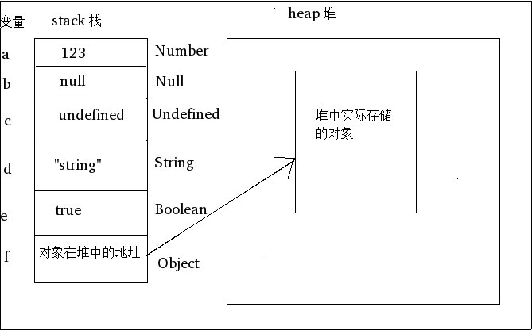
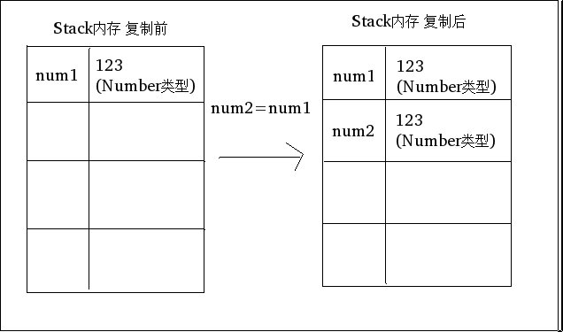
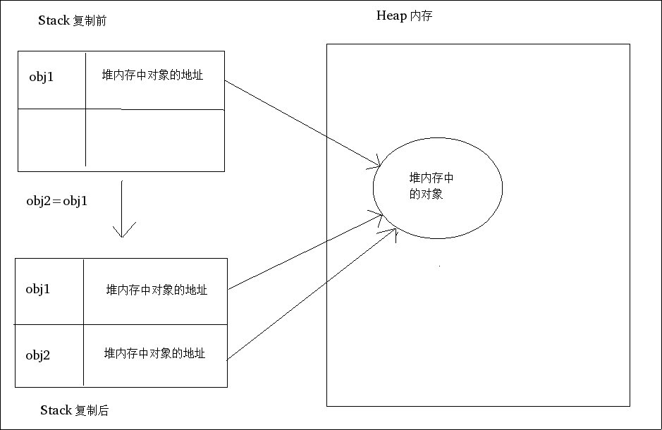

# 基本类型和引用类型的值

***

### 理解基本类型和引用类型

所谓基本类型，是指 String,Number,Boolean,Null,Undefined这5种类型。这5种基本类型的**访问**是**按值访问**的。

基本类型的数据和变量名本身是存储在内存中的栈中。

所谓引用类型，是指 那些包含了多个值的Object对象类型。对这种对象的**访问**是 **按引用访问**的。

引用类型的变量名(引用)是存储在内存中的栈中，但是对象数据本身是存储在内存中的堆中的。

其内存图示意图如下。 需要说明的是，所谓变量名，其实只是一个标记而已，**标识着内存中的某块地址**。

***

### 对象具有动态的属性

这里的动态的概念是指的我们可以随时为对象添加属性字段。或者是删除属性字段。

但是基本类型是不能添加或者删除属性的。因为基本类型的数据就是基本类型数据本身。如果其具有属性了，那就不是基本类型了，而是一组多个值构成的对象了。

***
### 复制变量值

这里同样要区分基本类型和引用类型(对象)。

对于基本类型来说，复制变量的操作是 读取原本变量的值，然后在内存的栈中分配一个新的变量空间，在这个新的变量空间中，
存储一个新的与原本变量值相同的 **值本身**。

对于引用类型来说，复制变量的操作是 读取原本变量的值，同样也在内存的栈中分配一个新的变量空间，在这个
新的空间中，存储一个新的与原本变量值相同的 **指向同一个对象的地址的值**。

这就是本质区别，基本类型在复制中所复制的实际数据就是 **值本身**,而引用类型只是 复制**堆中的对象地址**罢了。

***

### 参数的传递

ECMAScript中函数的参数传递都是**按值传递**的。 可以认为对函数传递参数，就是将外部的变量**复制**给**函数内部的局部变量**。(类似java)

***

### 检测类型

一般地，我们通过 typeof 操作符来检测 基本类型和Object对象:
* String类型 返回 string
* Number类型 返回 number
* Boolean类型 返回 boolean
* Undefined类型 返回 undefined
* Null 和Object类型 返回 object

但是可以看出来，typeof操作符对于检测引用类型是用处很小的。

当我们需要细致地知道 对象最具体的类型时，那么就需要使用 instanceof 操作符了

**任何对象 instanceof Object  都返回 true。**

**基本类型 instanceof 任何类型 都返回 false。**