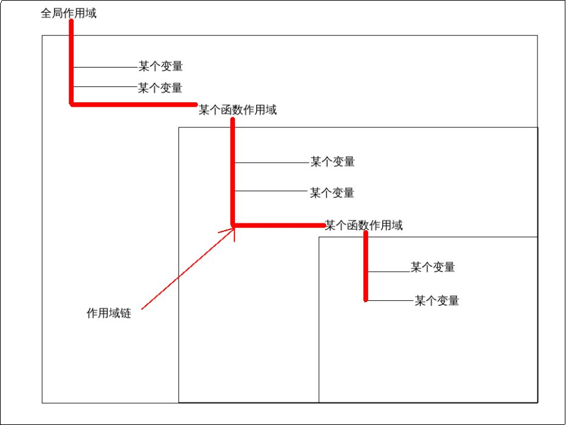

# 执行环境及作用域

关于执行环境(执行上下文)以及作用域，之前已经非常详细的讲述过了，这里就不再提了。

***

### 延长作用域链

特别地，虽然ECMAScript中创建作用域的方式只有两种：

* 全局自带的作用域

* 函数创建的作用域

但是，还有是特别的方法，将**作用域链**进行扩展延伸。
（虽然作用域链是由作用域构成的，按道理来说，唯有创建作用域的两种方式才能将这条作用域链进行延伸，但是实际上，还有另外两种特殊方法也可以进行作用域延伸）

在这里我们还要单独说一下作用域链，这对理解作用域链以及其延伸非常重要。

最开始，我们就说到，作用域最大的作用是**分隔变量**。由此才产生了自由变量的问题，
而作用域链就是为了解决自由变量的问题自然而然产生的。

所谓作用域链就是 从内层作用域所包含的变量 到 更外层作用域所包含的变量 中 寻找变量 的过程。
全局拥有全局作用域，函数拥有函数作用域。

自由变量的寻找就是**沿着作用域链的最前端(最内部)**，一直寻找到全局作用域的过程。

而所谓的延长作用域，可以认为是在作用域的最前端(最内部)，再添加一个额外的作用域的过程。

总共有两种方式对作用域进行延伸:

* try-catch语句的catch块：在作用域链的最前端添加了一个 **本身包含异常对象**的作用域。

* with语句：在作用域的最前端添加了一个 **本身包含某个任意对象**的作用域。

对于**本身包含**的理解应该是：就算该作用域里**没有声明任何变量，也存在**的变量。

***

#### try-catch

对于try-catch异常捕获语句而言,一般来讲形如:

    try{
        ...
        代码块
        ...
    }catch(someError){  //在try块语句抛出异常时进入catch块语句执行。
        ...
        代码块
        ...
    }

可以看到，由于捕获异常的原因，因此catch块的确是延伸了当前作用域，
或者说，是类似函数一样，新建了一个 **本身包含异常对象的作用域**。

***

#### with语句

而with语句呢? with语句,则更加宽松.
其使用方式如下:

    ...
    with(某个对象){
        ...
        代码块
        ...
    }
    ...

with语句更多的是类似于一种语法糖。

如果说 try-catch中延伸的作用域的**异常对象是无中生有,本来不存在的**,

那么with语句所包含的那个任意对象，则是**必须本来就存在并且可以在当前作用域中可访问到的自由变量**。

with语句将该对象添加到作用域链的最前端，因此，在with语句代码段中，
任何变量的取值会**被首先认为**是**该对象的某个属性**从该对象中进行寻找。

#### 再次重申，没有块级作用域！！！

ECMAScript中变量是**依赖于执行上下文**而存在的。而执行上下文的创建只有三种：

* 全局代码段(主函数)

* 普通函数体

* eval代码段

以上两种延长作用域链的方式延长的也**仅仅是作用域链**，**绝不会创建新的执行上下文**.

因此，以上**延长的作用域内**使用var声明的变量，是依托于该作用域所在的执行上下文环境的。

可以说,try-catch 和 with语句 也仅仅是一种**既普通又特别的块级代码块**。

**普通**在于:其内使用var声明的变量依旧是**属于该语句所在代码段的执行上下文中**的。

**特别**在于：普通的块级代码块无法延伸作用域链，而这两种可以延伸作用域链。

因此我们可以说:try-catch,with语句是一种可以**延伸作用域链**的**块级代码块**.